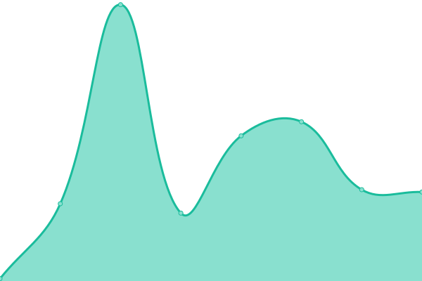

# [📈 Live Status](https://status.capital-placement.com): <!--live status--> **🟩 All systems operational**

This repository contains the open-source uptime monitor and status page for [Capital Placement](https://capital-placement.com/), powered by [Upptime](https://github.com/upptime/upptime).

With [Upptime](https://upptime.js.org), you can get your own unlimited and free uptime monitor and status page, powered entirely by a GitHub repository. We use [Issues](https://github.com/capital-placement/uptime/issues) as incident reports, [Actions](https://github.com/capital-placement/uptime/actions) as uptime monitors, and [Pages](https://status.capital-placement.com) for the status page.

<!--start: status pages-->
<!-- This summary is generated by Upptime (https://github.com/upptime/upptime) -->
<!-- Do not edit this manually, your changes will be overwritten -->
<!-- prettier-ignore -->
| URL | Status | History | Response Time | Uptime |
| --- | ------ | ------- | ------------- | ------ |
|  [CP](https://capital-placement.com/) | 🟩 Up | [cp.yml](https://github.com/capital-placement/uptime/commits/HEAD/history/cp.yml) | 

 236ms
     
 | 

<a href="https://status.capital-placement.com/history/cp">100.00%</a>
    

|  [CP Blog](https://capital-placement.com/blog/) | 🟩 Up | [cp-blog.yml](https://github.com/capital-placement/uptime/commits/HEAD/history/cp-blog.yml) | 

 78ms
     
 | 

<a href="https://status.capital-placement.com/history/cp-blog">100.00%</a>
    

|  [CP Dev](https://cwdev.capital-placement.com/) | 🟩 Up | [cp-dev.yml](https://github.com/capital-placement/uptime/commits/HEAD/history/cp-dev.yml) | 

 295ms
     
 | 

<a href="https://status.capital-placement.com/history/cp-dev">100.00%</a>
    

|  [Accounting Sector/ Industry Page](https://capital-placement.com/accounting-audit/) | 🟩 Up | [accounting-sector-industry-page.yml](https://github.com/capital-placement/uptime/commits/HEAD/history/accounting-sector-industry-page.yml) | 

 86ms
     
 | 

<a href="https://status.capital-placement.com/history/accounting-sector-industry-page">100.00%</a>
    

|  [TCC](https://the-consulting.co/) | 🟩 Up | [tcc.yml](https://github.com/capital-placement/uptime/commits/HEAD/history/tcc.yml) | 

 332ms
     
 | 

<a href="https://status.capital-placement.com/history/tcc">100.00%</a>
    

<!--end: status pages-->

[**Visit our status website →**](https://status.capital-placement.com)

## 📄 License

- Powered by: [Upptime](https://github.com/upptime/upptime)
- Code: [MIT](./LICENSE) © [Capital Placement](https://capital-placement.com/)
- Data in the `./history` directory: [Open Database License](https://opendatacommons.org/licenses/odbl/1-0/)
